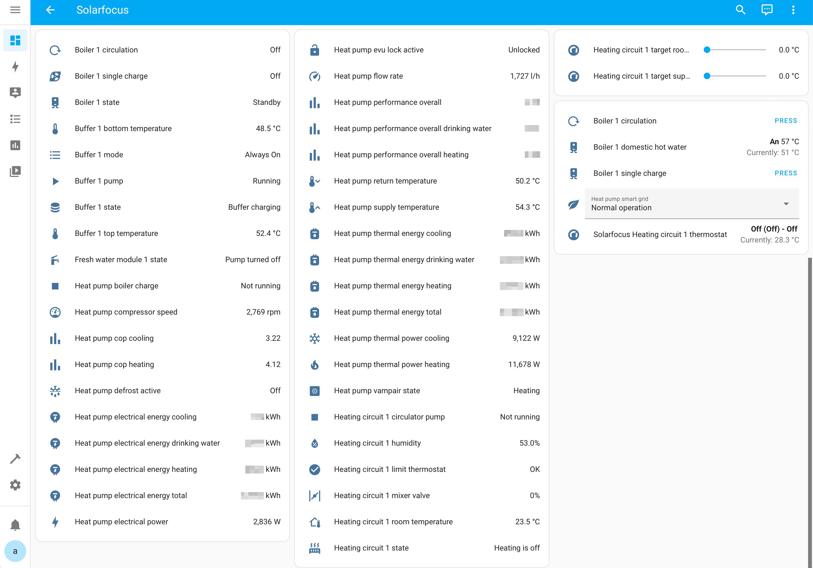

[![Installs][installs-shield]][installs]

  

<h3 align="center">Home Assistant Solarfocus ecomanager-touch integration</h3>

  Custom component for integrating <a href="https://www.solarfocus.com/">Solarfocus</a> heating systems into Home Assistant.

  
Table of Contents

1. [About](#about)
2. [Home Assistant Device Types](#home-assistant-device-types)
3. [Supported Solarfocus Software and Hardware](#supported-solarfocus-software-and-hardware)
4. [Getting Started](#getting-started)
   - [Prerequisites](#prerequisites)
   - [HACS Installation](#hacs-installation)
   - [Manual Installation](#manual-installation)
   - [Integration Setup](#integration-setup)
5. [Contribution](#contribution)
6. [Localization](#localization)
   

## About

This Home Assistant custom component is a community driven effort to integrate Solarfocus heating systems to Home Assistant allowing to monitor and control heat pumps, biomass boilers, domestic hot water, buffers, solar, and more. It is not affiliated, associated, authorized, endorsed by, or in any way officially connected with the [SOLARFOCUS GmbH](https://www.solarfocus.com/en/footer-bar/about-us).

> **Warning**
> Use with caution, in case of doubt check with Solarfocus or your installer if a feature / functionality (e.g. cooling) is supported by your installation to avoid damages to your heating system or the building.

The project uses the Python library [pysolarfocus](https://github.com/LavermanJJ/pysolarfocus) for retrieving values via Modbus TCP from the heating system.

## Home Assistant Device Types

There is currently support for the following device types within Home Assistant:

- Sensors
- Binary Sensors
- Numbers
- Buttons
- Selects
- Water Heater
- Climate

### Climate
In a first version, the climate entity only supports heating. As some heat pump installations also support cooling, this may be added at a later point in time. However, as it is possible to use a heat pump system for cooling, which is not intent for that by the way it was built, damage to the building or system from condensate is possible. 

Additionally, it is only possible to set the state (_preset_) but not setting the supply nor room temperature. This can be done using the `number` entities. A later version may add control as well. For now, we leave that to the programmed heating curve from Solarfocus. 

## Supported Solarfocus Software and Hardware

### Software

> **Important**
> This integration has been tested with Solarfocus ecomanager-touch version `23.020`.

Supported versions: `21.140` - `23.020`. Features added in later versions are not yet supported.

The ecomanager-touch Modbus TCP specification can be found [here](https://www.solarfocus.com/de/partnerportal/pdf/open/UGFydG5lcmJlcmVpY2gtREUvUmVnZWx1bmdfZWNvbWFuYWdlci10b3VjaC9BbmxlaXR1bmdlbi9lY29tYW5hZ2VyLXRvdWNoX01vZGJ1cy1UQ1AtUmVnaXN0ZXJkYXRlbl9BbmxlaXR1bmcucGRm/117920/0/Lng_YSxpM245S30zMTc4W2Y8cVRRXWlJVWRQJDsv?serialNumber=21010).

### Hardware

The ecomanager-touch can integrate the following heating systems
- [Vampair](https://www.solarfocus.com/en/products/air-source-heat-pump-vampair) heat pumps
- [Therminnator](https://www.solarfocus.com/en/products/biomassheating) biomass boilers
- [Ecotoplight / Ecotopzero](https://www.solarfocus.com/de/produkte/biomasseheizung/pelletkessel/ecotop) biomass boilers (_beta_)
- [Octoplus](https://www.solarfocus.com/en/products/biomassheating/pellet-boiler/octoplus) biomass boilers

| Components | Supported |
|---|---|
| Heating Circuit 1 - 8 (_Heizkreis_)| :white_check_mark: |
| Buffer 1 - 4 (_Puffer_) | :white_check_mark: |
| Solar (_Solar_)| :white_check_mark: |
| Boiler 1 - 4 (_Boiler_) | :white_check_mark: |
| Heat Pump (_Wärmepumpe_) | :white_check_mark: |
| Biomass Boiler (_Kessel_) | :white_check_mark: | 
| Fresh Water Module 1 - 4 (_Frischwassermodul_) | :white_check_mark: |

## Getting Started

### Prerequisites

Home Assistant v2023.1.2 or above.

### HACS Installation

You can find it in the default HACS repo. Just search `Solarfocus`.

### Manual Installation

- Copy all files from `custom_components/solarfocus/` to `custom_components/solarfocus/` inside your config Home Assistant directory.
- Restart Home Assistant to install all dependencies

### Integration Setup

 

## Contribution

If you encounter issues or have any suggestions consider opening issues and contributing through PR. If you are ready to contribute to this please read the [Contribution guidelines](CONTRIBUTING.md).

## Localization

Currently the integration supports the following languages:

- English
- German

[installs-shield]: https://img.shields.io/badge/dynamic/json?url=https%3A%2F%2Fanalytics.home-assistant.io%2Fcustom_integrations.json&query=%24.solarfocus.total&style=for-the-badge&label=Installs&color=green
[installs]: https://analytics.home-assistant.io/custom_integrations.json
