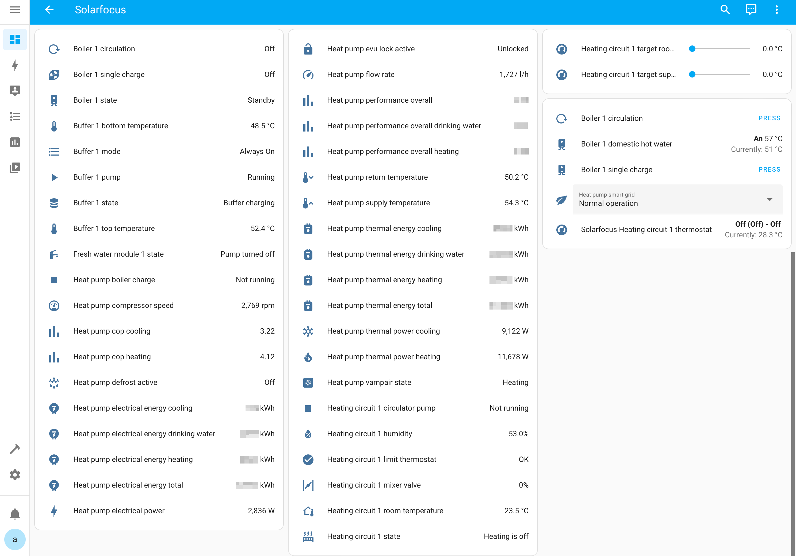

[](https://github.com/hacs/integration)
[![Installs][installs-shield]][installs]
[](https://img.shields.io/github/v/tag/lavermanjj/home-assistant-solarfocus?style=for-the-badge&label=Version&color=orange)
[](https://img.shields.io/github/license/lavermanjj/home-assistant-solarfocus?style=for-the-badge)


<p align="center">
  <a href="https://github.com/lavermanjj/home-assistant-solarfocus">
    
  </a>
</p>

<h3 align="center">Home Assistant Solarfocus eco<sup>manager-touch</sup> integration</h3>

<p align="center">
  Custom component for integrating <a href="https://www.solarfocus.com/">Solarfocus</a> heating systems into Home Assistant.
</p>


<details open="open">
  <summary>Table of Contents</summary>

1. [About](#about)
2. [Home Assistant Device Types](#home-assistant-device-types)
3. [Supported Solarfocus Software and Hardware](#supported-solarfocus-software-and-hardware)
4. [Getting Started](#getting-started)
   - [Prerequisites](#prerequisites)
   - [HACS Installation](#hacs-installation)
   - [Manual Installation](#manual-installation)
   - [Integration Setup](#integration-setup)
   - [Installation Parameters](#installation-parameters)
   - [Configuration Options](#configuration-options)
   - [Changing the Connection](#changing-the-connection)
   - [Removing the Integration](#removing-the-integration)
5. [Supported Functionality](#supported-functionality)
6. [How Data Is Updated](#how-data-is-updated)
7. [Use Cases](#use-cases)
8. [Known Limitations](#known-limitations)
9. [Troubleshooting](#troubleshooting)
10. [Contribution](#contribution)
11. [Localization](#localization)

</details>


## About

This Home Assistant custom component is a community driven effort to integrate Solarfocus heating systems to Home Assistant allowing to monitor and control heat pumps, biomass boilers, domestic hot water, buffers, solar, and more. It is not affiliated, associated, authorized, endorsed by, or in any way officially connected with the [SOLARFOCUS GmbH](https://www.solarfocus.com/en/footer-bar/about-us).

> **Warning**
> Use with caution, in case of doubt check with Solarfocus or your installer if a feature / functionality (e.g. cooling) is supported by your installation to avoid damages to your heating system or the building.

The project uses the Python library [pysolarfocus](https://github.com/LavermanJJ/pysolarfocus) for retrieving values via Modbus TCP from the heating system.

## Home Assistant Device Types

The integration provides `sensor`, `binary_sensor`, `number`, `button`, `select`, `switch`,
`water_heater` and `climate` entities. [Supported Functionality](#supported-functionality)
lists which of them each component gets; the sections below describe the ones that need more
than a line.

### Climate

The climate entity supports heating, cooling and switching the heating circuit off, and it
sets the flow temperature (_target temperature_) as well as the state (_preset_).

Section 6.2 of the Solarfocus Modbus specification requires all registers of a heating
circuit to be written together whenever the mode changes, otherwise the controller can end
up in an undefined state. Selecting a mode therefore writes:

| Mode | 32600 flow setpoint | 32602 cooling | 32603 operating mode | 32608 circuit mode |
|---|---|---|---|---|
| Heat | setpoint | 0 | preset | 2 (heating + cooling) |
| Cool | setpoint | 1 | preset | 2 (heating + cooling) |
| Off | 0 | 0 | 3 (off) | 2 (heating + cooling) |

The specification writes 0 (continuous operation) into 32603 for heating and cooling. The
integration keeps the preset you configured instead and only switches a circuit that is off
back on, so a comfort, eco or auto schedule is not discarded when you switch modes.

Because switching off writes a flow setpoint of 0, the integration remembers the last
setpoint per mode and restores it when the circuit is switched on again. It survives a
Home Assistant restart.

#### Cooling

> **Warning**
> Writing register 32602 **disables the dew point monitoring of the Solarfocus controller**.
> From then on the flow temperature has to be kept above the dew point of every room by
> Home Assistant. If it is not, condensate forms and can damage the building. A heat pump
> system that was not built for cooling can also be damaged. Check with Solarfocus or your
> installer whether cooling is supported by your installation before you use it.

Cooling is only offered from api version 22.090 on, as register 32608 does not exist below
it and the circuit cannot be switched to "heating + cooling" without it.

The integration does not calculate the dew point for you - it logs a warning the first time
a circuit is switched to cooling and otherwise leaves the responsibility with your
automations. The heating circuit exposes `room_temperature` and `humidity` sensors you can
build that on.

> **Warning**
> Feeding the external room humidity back to the heating system does **not** give you dew
> point protection. Per the specification, register 32607 "is only used for display in the
> visualization, the value is ignored for the dew point calculation". Active dew point
> monitoring means Home Assistant computing the dew point itself and driving the cooling
> flow setpoint (register 32600) accordingly, which is what the climate entity writes when
> you set its target temperature.

Note that the "outdoor shutdown temperature heating" parameter on the control panel stays
active for heating. If the outdoor temperature is above it, the circuit will not start
heating regardless of what is written over Modbus; set the parameter to 45°C to disable it.



### Photovoltaic

Next to the photovoltaic sensors read from the heating system, the integration provides `number` entities to feed the
heating system with values measured elsewhere in Home Assistant. This allows the eco<sup>manager-touch</sup> to optimize
the heating times and the consumption of self-produced electricity:

| Entity | Register | Description |
|---|---|---|
| `number.solarfocus_photovoltaic_smart_meter` | 33407 | Measured power at the house feed-in |
| `number.solarfocus_photovoltaic_photovoltaic` | 33408 | Generated power of the PV system |
| `number.solarfocus_photovoltaic_grid_im_export` | 33409 | Grid consumption (positive) / feed-in (negative) |
| `number.solarfocus_photovoltaic_hems_target_electrical_power` | 33415 | Target electrical power of the heat generator during PV overcharge (requires version `26.020`) |

Use an automation to forward the values of your own meters, e.g. on every state change of the corresponding sensor.

> **Important**
> The eco<sup>manager-touch</sup> rejects these values unless it is configured to accept them. In the _Photovoltaic_ mask
> of the display, set the source to `Modbus` and enter the IP address of your Home Assistant instance. Without this, all
> writes to these registers are ignored. It may take a moment until the transmitted values are shown on the display.

### External room sensors

A heating circuit can be fed with a room temperature and a room humidity measured elsewhere in
Home Assistant, so that a circuit without a Solarfocus room sensor can still be controlled:

| Entity | Register | Range | Description |
|---|---|---|---|
| `number.solarfocus_heating_circuit_1_indoor_temperature_external` | 32606 | 0 - 45 °C | Room temperature from an external controller |
| `number.solarfocus_heating_circuit_1_indoor_humidity_external` | 32607 | 0 - 100 % | Room humidity from an external controller |

Writing `0` is not a measurement of zero - the heating system then ignores the register and falls
back to its own sensor. Note that the humidity is only used for the display in the visualization
of the eco<sup>manager-touch</sup>, see the warning about the dew point under [Climate](#climate).

## Supported Solarfocus Software and Hardware

### Software

> **Important**
> This integration has been tested with Solarfocus eco<sup>manager-touch</sup> version `25.030`.

Supported versions: `21.140` - `26.020`. Features added in later versions are not yet supported.

The eco<sup>manager-touch</sup> Modbus TCP specification can be found [here](https://www.solarfocus.com/de/partnerportal/pdf/open/UGFydG5lcmJlcmVpY2gtREUvUmVnZWx1bmdfZWNvbWFuYWdlci10b3VjaC9BbmxlaXR1bmdlbi9lY29tYW5hZ2VyLXRvdWNoX01vZGJ1cy1UQ1AtUmVnaXN0ZXJkYXRlbl9BbmxlaXR1bmcucGRm/117920/0/Lng_YSxpM245S30zMTc4W2Y8cVRRXWlJVWRQJDsv?serialNumber=21010).

### Hardware

The eco<sup>manager-touch</sup> can integrate the following heating systems
- [Vamp<sup>air</sup>](https://www.solarfocus.com/en/products/air-source-heat-pump-vampair) heat pumps
- [Thermin<sup>nator</sup>](https://www.solarfocus.com/en/products/biomassheating) biomass boilers
- [Ecotop<sup>light</sup> / Ecotop<sup>zero</sup>](https://www.solarfocus.com/de/produkte/biomasseheizung/pelletkessel/ecotop) biomass boilers (_beta_)
- [Octo<sup>plus</sup>](https://www.solarfocus.com/en/products/biomassheating/pellet-boiler/octoplus) biomass boilers
- [pellet<sup>elegance</sup>](https://www.solarfocus.com/pelletelegance) biomass boilers (select ecotop)

| Components | Supported |
|---|---|
| Heating Circuit 1 - 8 (_Heizkreis_)| :white_check_mark: |
| Buffer 1 - 4 (_Puffer_) | :white_check_mark: |
| Solar (_Solar_)| :white_check_mark: |
| Boiler 1 - 4 (_Boiler_) | :white_check_mark: |
| Heat Pump (_Wärmepumpe_) | :white_check_mark: |
| Biomass Boiler (_Kessel_) | :white_check_mark: | 
| Fresh Water Module 1 - 4 (_Frischwassermodul_) | :white_check_mark: |

## Getting Started

### Prerequisites

- Home Assistant v2025.1.0 or above.
- An eco<sup>manager-touch</sup> reachable over the network, with Modbus TCP enabled on its
  display. The integration reads and writes registers over Modbus TCP; there is no cloud
  account and no authentication involved.

### HACS Installation

You can find it in the default HACS repo. Just search `Solarfocus`.

[](https://github.com/hacs/integration)


### Manual Installation

- Copy all files from `custom_components/solarfocus/` to `custom_components/solarfocus/` inside your config Home Assistant directory.
- Restart Home Assistant to install all dependencies

### Integration Setup

[](https://my.home-assistant.io/redirect/config_flow_start/?domain=solarfocus) 

Setup runs in two steps: first the connection details, then the components your installation
has. The connection is tested before the second step is shown, so a wrong address is reported
right away.

### Installation Parameters

The first step of the setup asks for:

| Parameter | Default | Description |
|---|---|---|
| Name | `Solarfocus` | Name of the entry, and the name every entity of it is identified by. Pick a distinct one per system and do not change it afterwards, see [Known Limitations](#known-limitations). |
| Host | `solarfocus` | Hostname or IP address of the eco<sup>manager-touch</sup>. |
| Port | `502` | Modbus TCP port of the controller. |
| Polling interval (s) | `10` | Seconds between two reads of the heating system. Values below 5 are rejected. |
| Solarfocus System | `Heat pump vampair` | `vampair`, `Therminator II` or `EcoTop`. This decides which components the second step offers and which entities exist, and it is the one setting that cannot be changed afterwards. |
| Solarfocus API Version | `23.020` | Software version of your eco<sup>manager-touch</sup>, see [Software](#software). Entities that need a newer version than the one selected are not created. |

The second step asks which components your installation has. Everything here can be changed
later, see below.

### Configuration Options

All of the following can be changed at any time via **Settings → Devices & Services →
Solarfocus → Configure**. Saving reloads the integration, so entities appear or disappear
immediately.

| Option | Range | Description |
|---|---|---|
| Polling interval (s) | ≥ 5 | Seconds between two reads. |
| Heating Circuit | 0 - 8 | Number of heating circuits (_Heizkreise_) to read. |
| Buffer | 0 - 4 | Number of buffer cylinders (_Puffer_). |
| Boiler | 0 - 4 | Number of boilers (_Boiler_). |
| Fresh water module | 0 - 4 | Number of fresh water modules (_Frischwassermodule_), from version `23.020`. |
| Solar | 0 - 4 | Number of solar circuits. More than one requires version `25.030`; below that only the first one is built, whatever the count says. |
| Heat Pump | on / off | vampair systems only. |
| Biomass boiler | on / off | Therminator and EcoTop systems only. |
| Photovoltaic | on / off | Photovoltaic sensors and the `number` entities used to feed values back, see [Photovoltaic](#photovoltaic). |

Setting a count to 0 (or a switch to off) stops that component from being polled and removes
its entities.

### Changing the Connection

The address of the controller, its Modbus TCP port and the API version are what it takes to
read the system at all, so they are not in the form above. Change them via **Settings →
Devices & Services → Solarfocus → the three-dot menu of the entry → Reconfigure**, which
asks for the connection on its own and leaves your component layout untouched.

| Setting | Description |
|---|---|
| Host | Address of the controller, e.g. after a DHCP change. |
| Port | Modbus TCP port. |
| Polling interval (s) | Seconds between two reads, the same setting as above. |
| Solarfocus API Version | Raise this after a software update of the heating system to get the entities that version added. Setting it higher than the controller runs makes it answer the wrong registers, see [Troubleshooting](#troubleshooting). |

### Removing the Integration

Go to **Settings → Devices & Services → Solarfocus**, open the three-dot menu of the entry
and choose **Delete**. This removes the config entry, its devices and all of their entities, and
stops the polling. Nothing is left behind on the heating system - the integration only reads
registers and writes the ones you changed from Home Assistant.

If the integration was installed manually rather than through HACS, also delete the
`custom_components/solarfocus/` directory from your Home Assistant configuration folder and
restart. Through HACS, remove it from the HACS integrations list instead.

Values that were written to the heating system (for example a target temperature, or the
photovoltaic registers) stay at the value last written. Set them back on the display of the
eco<sup>manager-touch</sup> if you do not want to keep them.

## Supported Functionality

The integration creates **one device per component**: every heating circuit, buffer, boiler,
fresh water module and solar circuit, plus the heat pump, photovoltaic and biomass boiler, all
of them attached to the eco<sup>manager-touch</sup> as their hub. Multi-instance components are
numbered in the name of the device (`Heating circuit 2`), which is why the entities on them are
called `Supply temperature` rather than `Heating circuit 2 supply temperature`.

A device is what Home Assistant assigns an area to, so a heating circuit can sit in the room it
heats. **If your Solarfocus device was in an area, every component device starts out in that same
area**, so nothing drops out of a room-scoped automation or voice command on the upgrade; move
the ones that belong elsewhere and they stay where you put them.

Lowering a count or switching a component off removes its device and every entity on it, so
nothing is left behind holding the value it had when it was last polled.

**Your existing entity ids do not change.** Entities already in the registry keep the ids they
were given, so an installation upgrading from 5.1.0 keeps its `sensor.solarfocus_...` ids.

Entities added **after** the upgrade - a component whose count you raise, or a fresh installation -
are named the way Home Assistant composes an id from the device and the entity:
`sensor.heating_circuit_1_supply_temperature`. The device half follows the language of your
installation (`sensor.heizkreis_1_supply_temperature` on a German one); the half that names the
reading is always English.

| Platform | Component | Entities |
|---|---|---|
| `sensor` | Heating circuit | Supply and room temperature, humidity, mixer valve, state |
| `sensor` | Buffer | Top and bottom temperature, state, mode, external sensors X35 / X36 / X44 |
| `sensor` | Boiler | Temperature, state, mode, single charge, circulation |
| `sensor` | Heat pump | Outdoor, supply and return temperature, flow rate, compressor speed, electrical and thermal energy and power, COP and overall performance, state |
| `sensor` | Biomass boiler | Temperature, status, message number, cleaning, ash container, outdoor temperature, operating mode, log wood, pellet usage, heat energy |
| `sensor` | Solar | Collector, supply, return and buffer temperatures, flow, current power, yields, state |
| `sensor` | Photovoltaic | Power, house consumption, heat pump consumption, grid import and export |
| `sensor` | Fresh water module | State, supply and target temperature, flow rate |
| `binary_sensor` | Heating circuit | Limit thermostat, circulator pump |
| `binary_sensor` | Buffer | Pump |
| `binary_sensor` | Heat pump | EVU lock active, defrost active, boiler charge |
| `binary_sensor` | Biomass boiler | Door contact |
| `binary_sensor` | Photovoltaic | Overcharge possible, overcharge active |
| `binary_sensor` | Fresh water module | Valve |
| `climate` | Heating circuit | One thermostat per circuit, see [Climate](#climate) |
| `water_heater` | Boiler | Domestic hot water |
| `number` | Heating circuit | Target supply and room temperature, external room temperature and humidity |
| `number` | Boiler | Target temperature |
| `number` | Photovoltaic | Smart meter, photovoltaic, grid import/export, HEMS target power, see [Photovoltaic](#photovoltaic) |
| `select` | Heating circuit | Mode, heating mode, cooling |
| `select` | Boiler | Holding mode |
| `select` | Heat pump | Smart grid |
| `switch` | Heat pump | EVU lock |
| `button` | Boiler | Single charge, circulation |

Some noisier or less commonly used entities are created disabled; enable them on the device
page if you need them. Which entities exist also depends on the configured API version and on
the system - a Therminator has no heat pump sensors, and entities added in a later software
version only appear once that version is selected.

### States of the mode and status entities

The state and mode entities report the value the heating system sends, as a number, and the
text you read in the interface is a translation of it. That is what Home Assistant expects of
an entity with a list of options, and it means the state does not change with the language.

So a condition or a template compares the number:

```yaml
condition:
  - condition: state
    entity_id: sensor.solarfocus_heat_pump_vampair_state
    state: "3" # Cooling
```

Picking the state in the automation editor does this for you - the dropdown shows the
translated texts and writes the matching number.

For the text itself, use `state_translated`, which follows the language of Home Assistant:

```yaml
{{ state_translated('sensor.solarfocus_heat_pump_vampair_state') }} # Cooling
```

The numbers are the ones in the Solarfocus register documentation, and the texts of every
state are listed in [`strings.json`](custom_components/solarfocus/strings.json).

## How Data Is Updated

The integration polls; the eco<sup>manager-touch</sup> does not push anything.

A single coordinator reads all configured components over one Modbus TCP connection, every
_polling interval_ seconds (10 by default). Every entity of the entry is updated from that one
read, so raising the number of components does not raise the number of round trips per
interval. The connection is opened once and re-established automatically if it drops.

If the heating system cannot be read at all, the entities of the entry become unavailable until
the next successful poll, and the failure is logged once rather than once per interval. If a
single component cannot be read while the others can, only that one keeps its last value and
the rest carry on; the log names it.

Writes go the other way and take effect immediately: setting a target temperature, pressing a
button or changing a select writes the register, re-reads the component it belongs to and
updates the entity right away, rather than waiting for the next interval.

## Use Cases

- **Feed your own meter readings back.** The heating system optimizes its running times around
  self-produced electricity if you push the values of your PV inverter and smart meter into it,
  see [Photovoltaic](#photovoltaic).
- **Room control without a Solarfocus room sensor.** Send the temperature of any Home Assistant
  sensor to a heating circuit, see [External room sensors](#external-room-sensors).
- **Cheap-tariff or surplus heating.** Use the `EVU lock` switch or the `Smart grid` select of
  the heat pump to block or request operation, driven by a dynamic electricity price or by PV
  surplus.
- **Hot water on demand.** Trigger the `Single charge` button of a boiler from an automation
  instead of keeping a schedule on the display.
- **Monitoring and statistics.** The heat pump energy sensors are `total_increasing`, so they
  can be added to the Energy dashboard, and the biomass boiler exposes pellet usage, ash
  container and cleaning levels for maintenance reminders.
- **Alerting.** `Message number` of the biomass boiler and the state sensors carry the
  translated fault texts of the controller and can be used for notifications.

## Known Limitations

These are properties of the integration or the Modbus interface, not bugs:

- **Polling only.** Changes made on the display of the heating system show up in Home Assistant
  after the next poll, not immediately.
- **No discovery.** The eco<sup>manager-touch</sup> announces itself over no protocol Home
  Assistant can pick up, so the address has to be entered by hand. Give the controller a fixed
  address or a DNS name.
- **No authentication.** Modbus TCP has none. Anyone with access to the network segment of the
  controller can read and write the same registers.
- **The system type cannot be changed.** Switching between vampair, Therminator and EcoTop means
  deleting the entry and setting it up again.
- **The name of an entry is part of the identity of its entities.** Renaming the config entry
  after setup gives the entities new unique ids: the old ones are orphaned and a duplicate set
  appears with a `_2` suffix. Rename the entities or one of the devices instead, both of which
  are safe.
  For the same reason two entries cannot share a name, and the setup rejects one that is taken.
- **Register coverage follows the specification of the selected version.** Features the
  eco<sup>manager-touch</sup> only offers on its display, and registers added after `26.020`,
  are not available.
- **Entity ids added before and after 6.0.0 look different.** Entities in the registry keep the
  id they were given, so an upgraded installation has `sensor.solarfocus_...` ids while anything
  added afterwards is `sensor.heating_circuit_1_...`, composed by Home Assistant from the device
  and the entity. Nothing existing moves; the two styles simply coexist.
- **The device half of an entity id follows the language of the installation.** A German
  installation names new entities `sensor.heizkreis_1_supply_temperature`. The half that names
  the reading is always English.
- **Writes can be ignored by the controller.** The photovoltaic registers only take effect once
  the display is configured for it, see [Photovoltaic](#photovoltaic), and the heating system
  keeps enforcing its own limits (for example the outdoor shutdown temperature) regardless of
  what is written.
- **Cooling turns off the dew point monitoring of the controller.** See the warning under
  [Cooling](#cooling).

## Troubleshooting

**Setup fails with "Failed to connect".**
Check that the address and port are right and reachable from the Home Assistant host
(`nc -z <host> 502`), and that Modbus TCP is enabled on the display of the
eco<sup>manager-touch</sup>. The controller accepts only a small number of connections at a
time, so close other Modbus clients pointing at it.

**All entities are unavailable.**
The heating system could not be read at all on the last poll. The log says why, once per outage
rather than once per interval. Common causes are the controller being restarted, a DHCP address
change (point the entry at the new address, see [Changing the Connection](#changing-the-connection))
or another Modbus client holding the connection.

**One component is stuck on old values while the rest updates.**
That component could not be read. The log names it, with a warning when it starts failing and
another when it recovers. If it fails on every poll, the registers of that component are
probably not answered by your software version - lower the API version under
[Changing the Connection](#changing-the-connection) or set the component to 0 under
[Configuration Options](#configuration-options) if your installation does not have it.

**Entities I expect are missing.**
Either the component is set to 0 in the options, or the entity needs a newer API version than
the one configured, or it does not exist for your system. Check the version selected under
[Changing the Connection](#changing-the-connection) against the version shown on your display,
and note that some entities are created disabled and have to be enabled on the device page.

**A device trigger or a device action in an automation stopped working.**
The entities moved from the one device an entry used to have onto the device of their component,
so an automation built in the UI against the old device no longer finds them. Open the automation
and pick the entity again - it will now be under `Heating circuit 1`, `Buffer 2` and so on. This
only affects automations that reference a **device**; anything naming an `entity_id` is unaffected.

**More than one solar circuit does not show up.**
Multiple solar circuits require API version `25.030` or newer. Below that the count is capped
at one.

**Values written from Home Assistant have no effect.**
For the photovoltaic registers, set the source to `Modbus` on the display, see
[Photovoltaic](#photovoltaic). For heating parameters, check that the heating system is not
overruling the value with a limit configured on the display.

**Getting a debug log.**
Add the following to `configuration.yaml` and restart, or use **Enable debug logging** on the
integration page:

```yaml
logger:
  default: info
  logs:
    custom_components.solarfocus: debug
    pysolarfocus: debug
```

The debug log contains the registers being read and written, which is what an issue report
needs.

## Contribution

If you encounter issues or have any suggestions consider opening issues and contributing through PR. If you are ready to contribute to this please read the [Contribution guidelines](CONTRIBUTING.md).

## Localization

Currently the integration supports the following languages:

- English
- German


[installs-shield]: https://img.shields.io/badge/dynamic/json?url=https%3A%2F%2Fanalytics.home-assistant.io%2Fcustom_integrations.json&query=%24.solarfocus.total&style=for-the-badge&label=Installs&color=green
[installs]: https://analytics.home-assistant.io/custom_integrations.json
